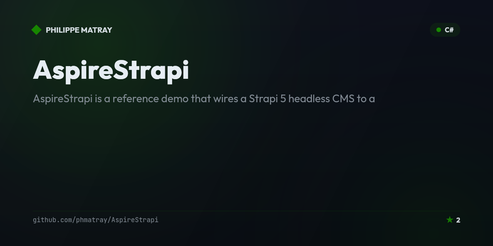

# AspireContainer — .NET Aspire container orchestration demos

<!-- portfolio-badges:start -->
<!-- Identity -->
[](https://github.com/phmatray/AspireContainer)

[](https://github.com/phmatray/AspireContainer/stargazers)
[](https://github.com/phmatray/AspireContainer/network/members)

<!-- Activity -->
[](https://github.com/phmatray/AspireContainer/issues)
[](https://github.com/phmatray/AspireContainer/pulls)
[](https://github.com/phmatray/AspireContainer/commits)
<!-- portfolio-badges:end -->


A .NET Aspire project showcasing container orchestration with real-world services: Plex media server, Flame dashboard, and FileBrowser — all managed via the Aspire AppHost.

## ✨ Features
- Plex media server container integration
- Flame dashboard for service management
- FileBrowser for web-based file management
- .NET Aspire AppHost orchestration
- Service discovery and health checks

## 📦 Installation
```bash
git clone https://github.com/phmatray/AspireContainer
cd AspireContainer
dotnet run --project AspireContainer.Demo
```

## 🚀 Quick Start
```bash
dotnet run --project AspireContainer.Demo
# Aspire Dashboard: https://localhost:15000
# Flame Dashboard: http://localhost:5005
# FileBrowser: http://localhost:8080
```

<!-- portfolio-techstack:start -->

## Tech Stack

- **.NET 8**
- Aspire.Hosting
- Microsoft.Extensions.Http.Resilience
- Microsoft.Extensions.ServiceDiscovery
- OpenTelemetry.Exporter.OpenTelemetryProtocol
- OpenTelemetry.Extensions.Hosting
- OpenTelemetry.Instrumentation.AspNetCore
- OpenTelemetry.Instrumentation.GrpcNetClient
- OpenTelemetry.Instrumentation.Http

<!-- portfolio-techstack:end -->

## 📄 License
MIT — see LICENSE

---

<!-- portfolio-sections:start -->

## Contributing

Contributions are welcome. Open an issue first to discuss any significant change.

1. Fork the repository and create your branch (`git checkout -b feat/my-feature`)
2. Commit your changes (`git commit -m 'feat: ...'`)
3. Push the branch and open a Pull Request

<!-- portfolio-sections:end -->
