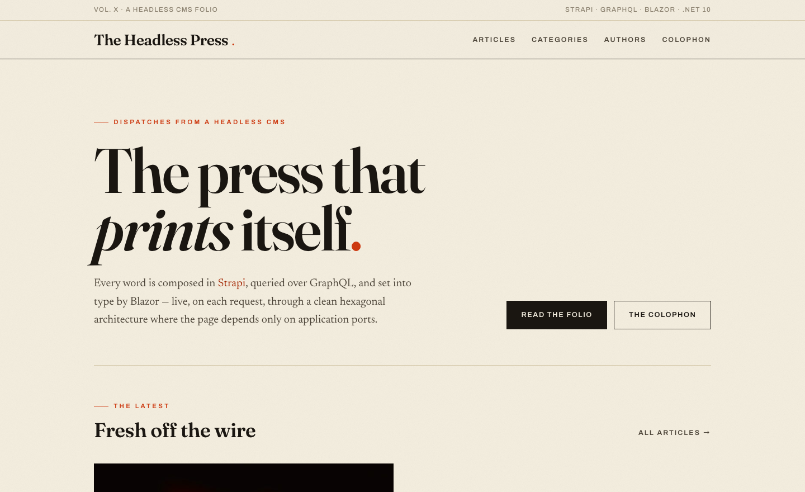
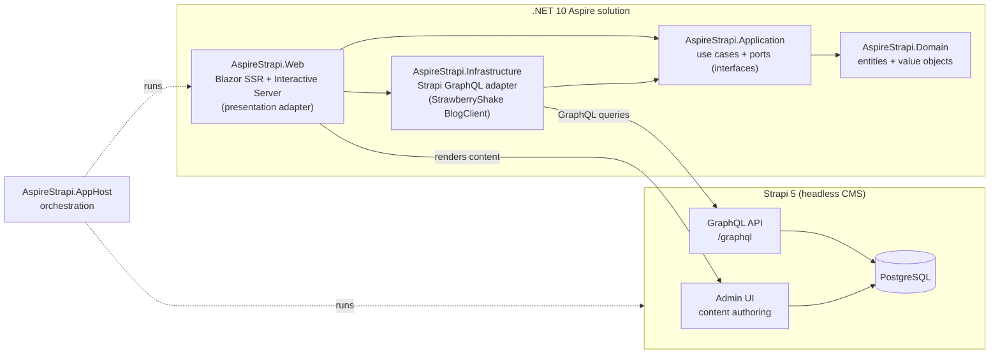
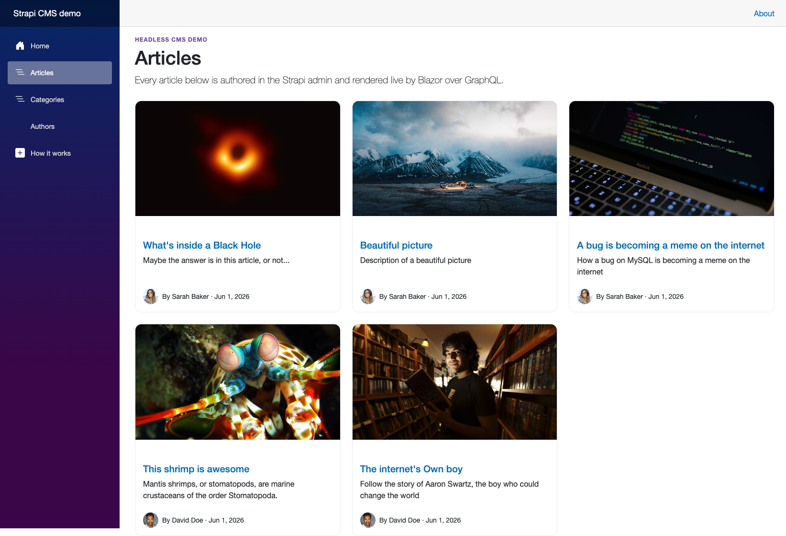
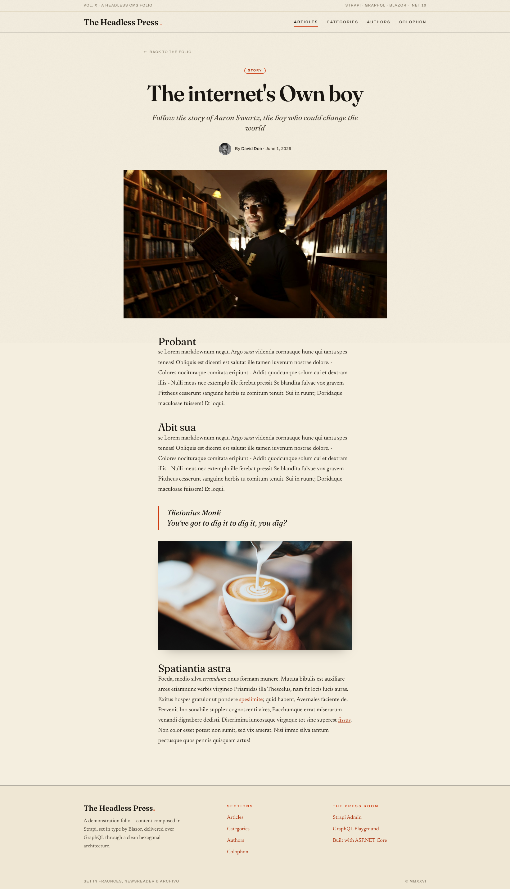

# AspireStrapi 🚀

[](https://dotnet.microsoft.com/)
[](https://learn.microsoft.com/dotnet/aspire/)
[](https://strapi.io/)
[](https://chillicream.com/docs/strawberryshake)
[](https://learn.microsoft.com/aspnet/core/blazor/)
[](./LICENCE.md)



AspireStrapi is a reference demo that wires a **Strapi 5 headless CMS** to a
**.NET 10 Aspire** application. Content is authored in the Strapi admin UI and
rendered live by a Blazor frontend that talks to Strapi over **GraphQL** using a
typed **StrawberryShake** client. The whole stack is orchestrated by Aspire for
local development and published to Docker Compose for deployment on OrbStack.

The code follows a **hexagonal (ports & adapters)** architecture, so the domain
and use cases never depend on Strapi, GraphQL, or Blazor — those are swappable
adapters at the edges.

📖 **Full documentation site:** <https://phmatray.github.io/AspireStrapi/>

## Features ✨

- **Headless CMS authoring** — editors write articles, authors, and categories in the Strapi 5 admin UI; the Blazor frontend renders them live, with no rebuild or redeploy needed to publish.
- **Typed GraphQL client** — StrawberryShake generates a typed `BlogClient` from hand-written `.graphql` queries against Strapi's flattened Strapi 5 schema.
- **Hexagonal architecture** — `AspireStrapi.Domain` and `AspireStrapi.Application` (the `ContentService` use case and its repository ports) never depend on Strapi, GraphQL, or Blazor.
- **Articles, authors & categories pages** — dedicated Blazor routes (`/articles`, `/authors`, `/categories`, `/headless-cms`) list and filter content pulled straight from the CMS.
- **Seeded demo content** — on first run, Strapi seeds 5 articles, 2 authors, and 5 categories with cover images, and grants public `find`/`findOne` permissions automatically.
- **.NET Aspire orchestration** — a single AppHost boots Postgres, Strapi, and the Blazor app together with service discovery, health checks, and OpenTelemetry.
- **One-command Compose deployment** — `aspire publish` emits a ready-to-run `docker-compose.yaml` + `.env` for running the whole stack on OrbStack.
- **Editorial Tailwind design** — "The Headless Press" is a magazine-style reading UI built with Tailwind CSS v4.

## Tech stack 💻

- **.NET 10 Aspire** — app orchestration, service discovery, and Docker Compose publishing
- **Strapi 5.47** — headless CMS (`@strapi/plugin-graphql`), Postgres-backed in production
- **GraphQL + StrawberryShake 16** — net10-native code generation of a typed `BlogClient`
- **Blazor** — Server-Side Rendering (SSR) + Interactive Server presentation
- **Tailwind CSS v4** — an editorial, magazine-style UI ("The Headless Press")
- **PostgreSQL** — content database for Strapi
- **OrbStack** — local Docker host for the published Compose deployment

## Architecture 🏗️

The .NET solution is split into hexagonal layers. Dependencies point inward and
are acyclic: the presentation and infrastructure adapters depend on the
application ports, and the application depends only on the domain.



- **AspireStrapi.Domain** — pure entities and value objects, no dependencies.
- **AspireStrapi.Application** — use cases (`ContentService`) and the repository
  **ports** (`IArticleRepository`, `IAuthorRepository`, …).
- **AspireStrapi.Infrastructure** — the **adapters** that implement those ports
  against Strapi's GraphQL endpoint via the generated `BlogClient`.
- **AspireStrapi.Web** — Blazor presentation that consumes the application ports.
- **AspireStrapi.AppHost / ServiceDefaults** — Aspire orchestration and shared
  defaults (telemetry, health checks, resilience).

## Quickstart ⚡

### Develop locally with Aspire

Prerequisites: .NET 10 SDK, Node.js 22, and a container runtime (Docker/OrbStack).

```bash
# from the repo root
dotnet run --project dotnet/AspireStrapi.AppHost
```

The AppHost starts Postgres, builds and runs Strapi (from
`cms`), and runs the Blazor frontend. On its **first run**
Strapi seeds the database with **5 articles, 2 authors, and 5 categories**
(with cover images) and grants public `find`/`findOne` permissions so the
GraphQL API is queryable without a token.

Open the Aspire dashboard from the console output to reach each resource.

### Deploy to OrbStack with `aspire publish`

```bash
# generate docker-compose.yaml + .env from the AppHost model
aspire publish dotnet/AspireStrapi.AppHost

# deploy on OrbStack
docker compose -f dotnet/AspireStrapi.AppHost/publish/docker-compose.yaml up -d
```

This uses the Aspire **Docker Compose compute integration**
(`AddDockerComposeEnvironment` + `PublishAsDockerComposeService`) to emit a
ready-to-run Compose file and `.env`.

| Service       | URL                                                  |
| ------------- | ---------------------------------------------------- |
| Blazor app    | <http://127.0.0.1:8090>                              |
| Strapi admin  | <http://127.0.0.1:1337/admin>                        |
| Strapi GraphQL| <http://127.0.0.1:1337/graphql>                      |

> Use `127.0.0.1`, not `localhost`. The frontend is published on host port
> **8090** (instead of 8080) to avoid colliding with other local services. It
> receives `Strapi__PublicBaseUrl=http://127.0.0.1:1337` so the **browser** can
> load media (cover images, avatars) directly from Strapi.

## Headless CMS 📰

Strapi is the system of record. Editors author articles, authors, and
categories in the Strapi admin UI, and the Blazor app renders them **live** by
querying Strapi's GraphQL endpoint — there is no rebuild or redeploy to publish
content.

| Articles list                              | Article detail                               |
| ------------------------------------------ | -------------------------------------------- |
|  |  |

## GraphQL usage (Strapi 5 flattened schema) 🔎

Strapi 5 returns a **flattened** schema — there is no more v4-style
`data`/`attributes` wrapping. StrawberryShake generates a typed `BlogClient`
from the `.graphql` queries in
`dotnet/AspireStrapi.Infrastructure/ApiClient`. For example, fetching articles:

```graphql
query GetArticles {
  articles(sort: ["publishedAt:desc"]) {
    documentId
    title
    description
    slug
    publishedAt
    cover { url }
    category { name slug }
    author { name email avatar { url } }
  }
}
```

The Infrastructure adapter consumes the generated result directly (flat fields,
no `.Data.Attributes`):

```csharp
var result = await _blogClient.GetArticles.ExecuteAsync(ct);
foreach (var article in result.Data!.Articles)
{
    // article.Title, article.Slug, article.Cover?.Url — all flat
}
```

The article's dynamic-zone **body** (`blocks`) is fetched with a small
hand-written GraphQL query (`StrapiArticleBodyClient`) because the generated
client cannot reliably model the dynamic-zone union. All GraphQL request bodies
use lowercase JSON keys (`query`, `variables`).

## Roadmap 🗺️

- [ ] Authentication/authorization for a private admin preview mode
- [ ] Output caching or incremental rendering for published articles
- [ ] Full-text search across articles
- [ ] Broader automated smoke-test coverage for Strapi content types
- [ ] A hosted live demo alongside the documentation site

Track progress and proposals in the [open issues](https://github.com/phmatray/AspireStrapi/issues).

## License 📄

This project is licensed under the terms of the [MIT license](./LICENCE.md).

---

<!-- portfolio-sections:start -->

## Contributing

Contributions are welcome. Open an issue first to discuss any significant change.

1. Fork the repository and create your branch (`git checkout -b feat/my-feature`)
2. Commit your changes (`git commit -m 'feat: ...'`)
3. Push the branch and open a Pull Request

<!-- portfolio-sections:end -->
