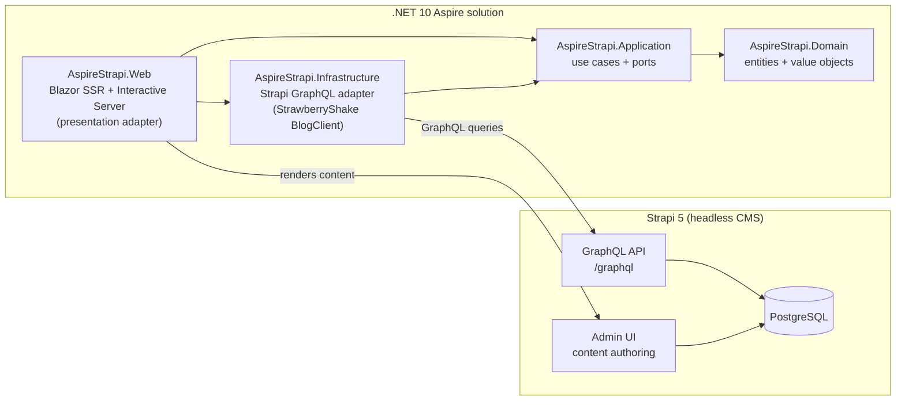

AspireStrapi follows a **hexagonal (ports & adapters)** architecture. The domain
and use cases are the core; everything else — Strapi, GraphQL, Blazor — is an
adapter at the edge. Dependencies point **inward** and the graph is **acyclic**.

## Layer diagram

## Layer responsibilities

### Domain (`AspireStrapi.Domain`)

The innermost layer: entities and value objects only. It has **no dependency**
on any other project, framework, or transport. It models the blog concepts
(articles, authors, categories) independent of how they are stored or rendered.

### Application (`AspireStrapi.Application`)

Holds the use cases and the **ports** — interfaces that the outside world must
satisfy:

- `IArticleRepository`, `IAuthorRepository`, `ICategoryRepository`,
  `IAboutPageRepository` — the repository ports.
- `ContentService` / `IContentService` — the use cases that orchestrate them.

Application depends **only on Domain**. It knows nothing about Strapi or GraphQL.

### Infrastructure (`AspireStrapi.Infrastructure`)

The **adapters** that implement the Application ports against Strapi's GraphQL
endpoint. This is where the generated StrawberryShake `BlogClient` lives, along
with repository implementations (`StrapiArticleRepository`, etc.), the
media-URL resolver, and the hand-written `StrapiArticleBodyClient` for the
dynamic-zone body. Infrastructure depends on **Application** (to implement its
ports) and **Domain** (to return domain types).

### Presentation (`AspireStrapi.Web`)

A Blazor app using **Server-Side Rendering (SSR)** plus the **Interactive
Server** render mode. It depends on the Application ports (and the
Infrastructure adapters via DI) to fetch and render content. It never talks to
GraphQL directly.

### Orchestration (`AspireStrapi.AppHost` / `AspireStrapi.ServiceDefaults`)

The AppHost is the Aspire orchestration model: it wires Postgres, Strapi, and
the Blazor frontend together for local dev and publishes the Docker Compose
deployment. ServiceDefaults provides shared telemetry, health checks, and
resilience handlers.

## Why this matters

Because the core depends only on ports, the Strapi/GraphQL adapter is fully
swappable: you could replace Strapi with another CMS or a REST backend by
writing new adapters, without touching the domain, use cases, or the Blazor UI.
